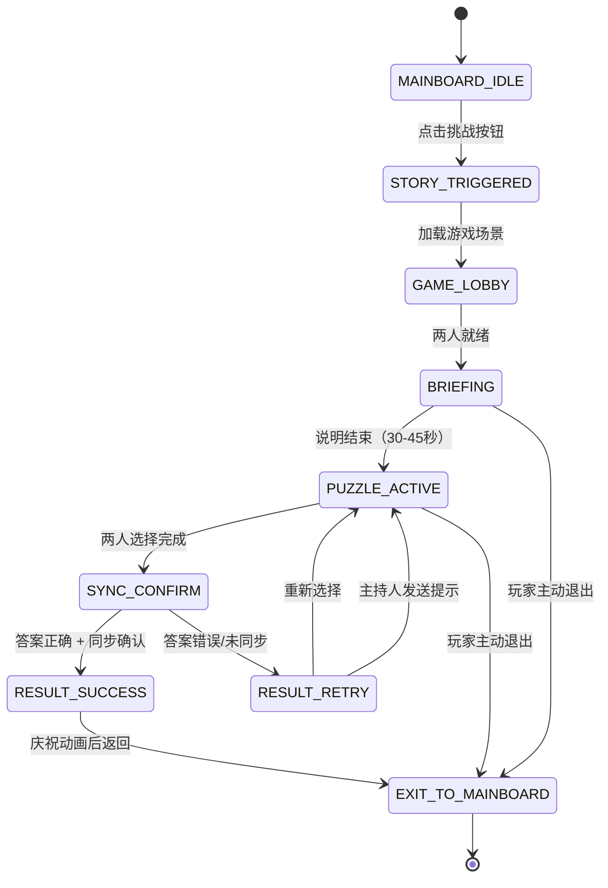

# 《La Puerta de Dos Llaves》双钥匙之门 - 完整产品设计文档

**项目名称**: La Puerta de Dos Llaves (The Two Keys Gate)
**目标项目**: Xuklis Quest - 青少年肿瘤治疗/随访协作严肃游戏
**文档版本**: 1.0
**语言**: 游戏内容西班牙语 | 设计文档中文
**最后更新**: 2025-12-13

---

## 📋 目录

1. [产品概述](#1-产品概述)
2. [系统架构与技术栈](#2-系统架构与技术栈)
3. [Mainboard 集成与状态机](#3-mainboard-集成与状态机)
4. [UI/UX 视觉与交互规范](#4-uiux-视觉与交互规范)
5. [核心游戏机制](#5-核心游戏机制)
6. [3 套可替换关卡设计](#6-3-套可替换关卡设计)
7. [开发任务拆分](#7-开发任务拆分)
8. [风险与伦理 (Responsible Checklist)](#8-风险与伦理-responsible-checklist)
9. [附录](#9-附录)

---

## 1. 产品概述

### 1.1 目标用户

**核心用户群体**:
- **年龄**: 12–18 岁青少年
- **健康状况**: 正在或曾经接受肿瘤治疗/随访
- **潜在特征**:
  - 体力/注意力波动（治疗副作用）
  - 情绪敏感、容易焦虑
  - 社交机会受限（隔离治疗、频繁住院）
  - 需要积极心理支持与社会连接

**设备与网络环境**:
- 医院平板 / 个人手机 / 电脑浏览器
- 网络条件不稳定（医院 WiFi、4G）
- 需要支持离线降级与断线重连

---

### 1.2 核心目标

#### 教育与心理目标
1. **促进社会连接**: 通过双人协作建立信任、沟通与归属感
2. **培养问题解决能力**: 信息互补机制鼓励主动沟通与逻辑推理
3. **提供心理安全感**: 无竞争、无失败惩罚的游戏环境

#### 游戏设计目标
- **时长控制**: 每个挑战 3–10 分钟完成（单个解锁任务 2–3 分钟）
- **认知负荷**: 简单规则 + 清晰反馈，适合注意力波动的用户
- **成就感**: 共同完成任务的积极体验

#### 技术目标
- **响应式设计**: 手机/平板/PC 全适配
- **网络容错**: 支持断线重连、降级轮询
- **无障碍性**: 支持色盲模式、大字号、键盘导航

---

### 1.3 Responsible / Safety 要求（必须重点体现）

#### ✅ 无竞争 (No Competition)
- ❌ 不计分、不排名、不淘汰、不羞辱
- ✅ 强调"合作完成"而非"谁更快/更好"

#### ✅ 无压力 (No Pressure)
- ❌ 无倒计时压迫（无"10秒内完成"的红色计时器）
- ❌ 无失败惩罚音效（无"嗡嗡"错误声、红色警报）
- ✅ 温和提示："还差一点点，再一起确认一下吧"

#### ✅ 无医疗隐喻 (No Medical Metaphors)
- ❌ 不出现癌症/治疗/死亡/医院恐怖氛围
- ✅ 主题使用：宇宙探险、奇幻森林、魔法符文、星际导航

#### ✅ 可退出/可跳过 (Exit Freedom)
- 玩家可随时点击"Volver al Tablero"（返回主板）
- 退出确认弹窗使用温和语气：
  **"¿Quieres salir del desafío? Puedes volver cuando quieras."**
  （要离开挑战吗？你随时可以再来。）
- 主持人可"一键解锁继续"，避免玩家长时间卡关

#### ✅ 隐私与数据最小化 (Privacy First)
- 仅保存 session 内临时数据（session_id、player_role、selected_answer）
- 不记录个人敏感信息（姓名、病历、心理状态）
- Session 结束后 30 分钟自动清理数据（TTL）

#### ✅ 主持人可控 (Moderator Control)
主持人（医护人员/辅导员）可以：
- 启动/结束 session
- 发送鼓励型提示（预设 + 自定义）
- 查看玩家状态（选择、同步情况）
- 必要时暂停游戏（但不能查看聊天内容，保护隐私）

---

### 1.4 设计约束

| 约束类型 | 说明 |
|---------|------|
| **时间约束** | 单个挑战 3–10 分钟（避免疲劳） |
| **认知负荷** | 规则可在 30 秒内理解 |
| **网络约束** | 支持 3G 网络、断线重连 |
| **设备约束** | 最低支持 iPhone 8 / Android 8.0 |
| **语言约束** | 西班牙语（未来可扩展多语言） |

---

## 2. 系统架构与技术栈

### 2.1 现有项目技术栈（已确认）

**当前 CarroRebelde-MJ 项目使用**:
- **Frontend**: React 19 + Vite（无 TypeScript，使用 .jsx）
- **Backend**: Colyseus 0.16 + Express + TypeScript
- **样式**: 原生 CSS（像素艺术风格，"Press Start 2P" 字体）
- **部署**: 开发阶段（未配置生产环境）

---

### 2.2 推荐技术栈（两套方案对比）

#### 🏆 方案 A：基于现有项目扩展（推荐）

**优势**:
- 与现有代码库无缝集成
- Colyseus 天生支持实时同步
- 团队已熟悉技术栈

| 层级 | 技术选型 | 理由 |
|------|---------|------|
| **Frontend** | React 19 + Vite + 原生 CSS | 保持现有风格一致性 |
| **State Management** | React Context API + useReducer | 轻量级，无需引入额外库 |
| **Real-time** | Colyseus Room（WebSocket） | 已集成，支持状态同步 |
| **Backend** | Node.js + Express + TypeScript | 现有后端框架 |
| **Session Store** | 内存 Map + TTL（30 分钟） | MVP 阶段无需 Redis |
| **Auth** | 邀请码（6 位随机码） | 简单可靠 |
| **Deployment** | 现有部署流程 | 与主项目一起部署 |

**实现路径**:
1. 在 `client/src/components/layout/` 创建 `TwoKeysGate.jsx`
2. 在 `server/src/rooms/` 创建 `TwoKeysRoom.ts`（Colyseus Room）
3. 在 `App.jsx` 添加路由逻辑（`?game=7`）
4. 复用现有 `game.css` 的像素艺术样式

---

#### 🚀 方案 B：独立快速原型（备选）

**适用场景**:
- 需要独立演示
- 不依赖主项目部署
- 快速迭代测试

| 层级 | 技术选型 | 理由 |
|------|---------|------|
| **Frontend** | Next.js 14 + TailwindCSS | 一体化框架，快速搭建 |
| **Real-time** | Pusher / Ably | 托管服务，省去服务器维护 |
| **Backend** | Next.js API Routes | 无需独立后端 |
| **Session Store** | Vercel KV（Redis） | Serverless 友好 |
| **Auth** | NextAuth.js（匿名登录） | 开箱即用 |
| **Deployment** | Vercel | 一键部署，免费 HTTPS |

**权衡**:
- ❌ 与现有像素艺术风格不一致（需重新设计 UI）
- ❌ 独立部署增加维护成本
- ✅ 适合快速演示/Hackathon

---

### 2.3 Stateless 的定义（必须明确）

#### ✅ 允许保存（Session 级别，30 分钟 TTL）

```typescript
interface SessionState {
  session_id: string;           // 会话唯一标识
  level_id: 1 | 2 | 3;          // 当前关卡（1:符号+情绪, 2:方向+颜色, 3:元素+形状）
  player_a: {
    socket_id: string;
    selected_answer: number[];  // 选择的答案序列（例如 [1, 3, 2]）
    confirmed_at: number | null;// 确认时间戳
  };
  player_b: {
    socket_id: string;
    selected_answer: number[];
    confirmed_at: number | null;
  };
  hint_count: number;           // 已使用提示次数（最多 2 次）
  state: 'lobby' | 'briefing' | 'active' | 'sync_confirm' | 'success' | 'retry';
  created_at: number;           // 会话创建时间
}
```

#### ❌ 不允许保存

- ❌ 长期用户档案（用户名、历史记录）
- ❌ 跨天进度（"上次玩到第 2 关"）
- ❌ 心理/健康数据（情绪状态、治疗记录）
- ❌ 可识别身份信息（真实姓名、医院编号）

#### 数据清理策略

```javascript
// 服务端自动清理逻辑
setInterval(() => {
  const now = Date.now();
  sessions.forEach((session, sessionId) => {
    if (now - session.created_at > 30 * 60 * 1000) { // 30 分钟
      sessions.delete(sessionId);
      console.log(`Session ${sessionId} expired and deleted`);
    }
  });
}, 5 * 60 * 1000); // 每 5 分钟检查一次
```

---

## 3. Mainboard 集成与状态机

### 3.1 状态机（State Machine）



---

### 3.2 状态详细说明

| 状态 | 说明 | 停留时间 | 玩家操作 |
|------|------|---------|---------|
| **MAINBOARD_IDLE** | 主界面待机 | 无限 | 点击挑战按钮 |
| **STORY_TRIGGERED** | 剧情触发（可选） | 5-10秒 | 自动跳转 |
| **GAME_LOBBY** | 等待玩家加入 + 角色分配 | 可变 | 输入邀请码/准备 |
| **BRIEFING** | 游戏说明 + 关卡预览 | 30-45秒 | 阅读说明，点击"开始" |
| **PUZZLE_ACTIVE** | 协作解谜中 | 2-3分钟 | 选择选项、聊天沟通 |
| **SYNC_CONFIRM** | 同步确认窗口 | 3-10秒 | 两人都点击"插入钥匙" |
| **RESULT_SUCCESS** | 成功庆祝 | 3-5秒 | 自动跳转 |
| **RESULT_RETRY** | 温和重试提示 | 2秒 | 重新选择 |
| **EXIT_TO_MAINBOARD** | 返回主界面 | 1秒过渡 | 自动跳转 |

---

### 3.3 路由与返回机制

#### 进入游戏

**方式 1: 从 Mainboard 直接跳转**
```javascript
// 在 App.jsx 中添加路由逻辑
const urlParams = new URLSearchParams(window.location.search);
const minigameId = urlParams.get('game');

if (minigameId === '7') {
  return <TwoKeysGate />;
}
```

**方式 2: 独立路由（推荐）**
```javascript
// 安装 react-router-dom
import { BrowserRouter, Route, Routes } from 'react-router-dom';

<Routes>
  <Route path="/" element={<Mainboard />} />
  <Route path="/challenge/two-keys" element={<TwoKeysGate />} />
</Routes>
```

**URL 格式**:
```
/challenge/two-keys?session=ABC123&role=A
```

#### 返回 Mainboard

**触发场景**:
1. 挑战完成（成功）
2. 玩家主动点击"Volver"（返回）
3. 主持人结束 session

**退出确认弹窗**:
```jsx
<div className="exit-modal">
  <h3>¿Quieres salir del desafío?</h3>
  <p>Puedes volver cuando quieras.</p>
  <button onClick={confirmExit}>Sí, salir</button>
  <button onClick={cancelExit}>Seguir jugando</button>
</div>
```

**返回逻辑**:
```javascript
const handleExit = () => {
  // 清理本地状态
  sessionStorage.removeItem('twokeys_session');

  // 通知服务器
  socket.emit('player_leave', { sessionId });

  // 跳转回 Mainboard
  window.location.href = '/';
};
```

---

### 3.4 Colyseus Room 实现伪代码

```typescript
// server/src/rooms/TwoKeysRoom.ts
import { Room, Client } from 'colyseus';
import { TwoKeysState } from './schema/TwoKeysState';

export class TwoKeysRoom extends Room<TwoKeysState> {
  maxClients = 2;

  onCreate(options: any) {
    this.setState(new TwoKeysState());
    this.state.level_id = options.level_id || 1;
    this.state.phase = 'lobby';
  }

  onJoin(client: Client, options: any) {
    // 分配角色 A 或 B
    if (this.state.player_a === null) {
      this.state.player_a = client.sessionId;
      client.send('role_assigned', { role: 'A' });
    } else {
      this.state.player_b = client.sessionId;
      client.send('role_assigned', { role: 'B' });

      // 两人就绪，进入 briefing
      this.state.phase = 'briefing';
      this.broadcast('phase_changed', { phase: 'briefing' });
    }
  }

  onMessage(client: Client, type: string, message: any) {
    switch (type) {
      case 'select_answer':
        this.handleSelectAnswer(client, message);
        break;
      case 'confirm_answer':
        this.handleConfirmAnswer(client);
        break;
      case 'request_hint':
        this.handleHint();
        break;
    }
  }

  handleConfirmAnswer(client: Client) {
    const role = this.state.player_a === client.sessionId ? 'A' : 'B';

    if (role === 'A') {
      this.state.player_a_confirmed = true;
    } else {
      this.state.player_b_confirmed = true;
    }

    // 两人都确认后，检查答案
    if (this.state.player_a_confirmed && this.state.player_b_confirmed) {
      this.checkAnswer();
    }
  }

  checkAnswer() {
    const isCorrect = this.state.player_a_answer.join(',') ===
                      this.state.correct_answer.join(',');

    if (isCorrect) {
      this.state.phase = 'success';
      this.broadcast('result', { success: true });

      // 5 秒后自动返回 Mainboard
      setTimeout(() => {
        this.broadcast('exit_to_mainboard');
      }, 5000);
    } else {
      this.state.phase = 'retry';
      this.broadcast('result', {
        success: false,
        message: 'Las llaves aún no están alineadas. ¡Intentemos de nuevo!'
      });

      // 重置确认状态
      this.state.player_a_confirmed = false;
      this.state.player_b_confirmed = false;
      this.state.phase = 'active';
    }
  }
}
```

---

## 4. UI/UX 视觉与交互规范

### 4.1 视觉风格（基于现有项目）

#### 颜色系统（保持现有像素艺术风格）

```css
:root {
  /* 背景色（深色） */
  --pixel-bg: #1a1a2e;      /* 主背景 */
  --pixel-dark: #0f0f1e;    /* 更深背景 */
  --pixel-light: #16213e;   /* 卡片背景 */

  /* 强调色（无"报警红"） */
  --pixel-yellow: #f9d71c;  /* 标题、关键信息 */
  --pixel-green: #00ff41;   /* 成功、确认按钮 */
  --pixel-blue: #00d9ff;    /* 提示、次要按钮 */
  --pixel-purple: #b300ff;  /* 角色标识 */

  /* 避免使用的颜色 */
  --pixel-red: #ff0040;     /* 仅用于紧急情况（不用于常规错误） */

  /* 中性色 */
  --pixel-white: #ffffff;
  --pixel-black: #000000;
  --pixel-gray: #888888;
}
```

#### 字体系统

```css
/* 主字体：像素艺术风格（保持现有） */
body {
  font-family: 'Press Start 2P', cursive;
  font-size: 12px;
  line-height: 1.6;
}

/* 大字号模式（无障碍） */
.large-text-mode {
  font-size: 16px;
  line-height: 1.8;
}

/* 按钮文字 */
.pixel-button {
  font-size: 10px;
  text-transform: uppercase;
  letter-spacing: 1px;
}
```

---

### 4.2 信息架构（页面布局）

#### 玩家端页面分区

```
┌─────────────────────────────────────────────────────────┐
│ [返回] La Puerta de Dos Llaves - Nivel 1/3       [设置] │ ← 顶部栏
├─────────────────────────────────────────────────────────┤
│                                                         │
│  ┌───────────────────────────────────────────────────┐ │
│  │  Tu Vista (Jugador A)                             │ │ ← 玩家专属信息卡
│  │  ────────────────────────────────────────────      │ │
│  │  Secuencia de símbolos:                           │ │
│  │  🌟 → 👾 → 🧊 → 🔮                                  │ │
│  │                                                    │ │
│  └────────────────────────────────────────────────────┘ │
│                                                         │
│  ┌──────────────────────┐  ┌────────────────────────┐  │
│  │ Chat del Equipo      │  │ Mensajes del Moderador │  │ ← 沟通区
│  │ A: "第一个是星星"      │  │ 💡 "Recuerden trabajar │  │
│  │ B: "明白，第一个..."  │  │    juntos paso a paso" │  │
│  └──────────────────────┘  └────────────────────────┘  │
│                                                         │
│  ┌───────────────────────────────────────────────────┐ │
│  │  Selecciona tu respuesta:                         │ │ ← 选项区
│  │  [ Curiosidad ]  [ Calma ]  [ Esperanza ] [Valor] │ │
│  └───────────────────────────────────────────────────┘ │
│                                                         │
│  [ Insertar Llave ] (esperando al otro jugador...)     │ ← 确认按钮
└─────────────────────────────────────────────────────────┘
```

#### 主持人端（独立页面）

```
┌─────────────────────────────────────────────────────────┐
│ Panel del Moderador - Sesión ABC123                      │
├──────────────────────┬───────────────────────────────────┤
│ Jugadores Conectados │ Estado Actual                    │
│                      │                                   │
│ 🟢 Jugador A (Ana)   │ Fase: PUZZLE_ACTIVE              │
│    Respuesta: [0,2,1]│ Nivel: 1 (Símbolos + Emociones)  │
│    Confirmado: ❌     │ Pistas usadas: 0/2               │
│                      │                                   │
│ 🟢 Jugador B (Luis)  │ Tiempo transcurrido: 1m 23s      │
│    Respuesta: [0,2,1]│                                   │
│    Confirmado: ✅     │                                   │
├──────────────────────┴───────────────────────────────────┤
│ Acciones del Moderador                                   │
│ [Enviar Pista Predefinida ▼] [Pista Personalizada...]   │
│ [⏸ Pausar Sesión] [⏹ Finalizar Sesión] [🔓 Desbloquear] │
└─────────────────────────────────────────────────────────┘
```

---

### 4.3 组件列表（可复用）

#### 1. 信息卡片（Player Info Card）

```jsx
// PlayerInfoCard.jsx
const PlayerInfoCard = ({ role, content }) => (
  <div className="control-section">
    <div className="section-title">
      {role === 'A' ? 'Tu Vista (Jugador A)' : 'Tu Información (Jugador B)'}
    </div>
    <div className="info-content">
      {content}
    </div>
  </div>
);
```

**CSS（复用现有样式）**:
```css
.control-section {
  background: var(--pixel-bg);
  border: 4px solid var(--pixel-white);
  box-shadow:
    inset -3px -3px 0px var(--pixel-black),
    inset 3px 3px 0px var(--pixel-white),
    6px 6px 0px var(--pixel-black);
  padding: 25px;
}
```

---

#### 2. 选项按钮（Answer Option Button）

```jsx
const AnswerButton = ({ label, icon, selected, onClick }) => (
  <button
    className={`answer-button ${selected ? 'selected' : ''}`}
    onClick={onClick}
  >
    {icon && <span className="button-icon">{icon}</span>}
    <span>{label}</span>
  </button>
);
```

**CSS（新增）**:
```css
.answer-button {
  background: var(--pixel-light);
  border: 3px solid var(--pixel-white);
  box-shadow:
    inset -2px -2px 0px var(--pixel-black),
    inset 2px 2px 0px var(--pixel-white),
    4px 4px 0px var(--pixel-black);
  padding: 15px 20px;
  font-size: 12px;
  color: var(--pixel-white);
  cursor: pointer;
  transition: all 0.2s;
  display: flex;
  align-items: center;
  gap: 10px;
  min-width: 150px;
  margin: 10px;
}

.answer-button:hover {
  transform: translate(2px, 2px);
  box-shadow:
    inset -2px -2px 0px var(--pixel-black),
    inset 2px 2px 0px var(--pixel-white),
    2px 2px 0px var(--pixel-black);
}

.answer-button.selected {
  background: var(--pixel-yellow);
  color: var(--pixel-black);
  border-color: var(--pixel-yellow);
  box-shadow:
    inset -3px -3px 0px var(--pixel-black),
    inset 3px 3px 0px var(--pixel-white),
    4px 4px 0px var(--pixel-black),
    0 0 15px var(--pixel-yellow);
}

.button-icon {
  font-size: 20px;
}
```

---

#### 3. 确认按钮（Confirm Button）

```jsx
const ConfirmButton = ({ disabled, waiting, onClick }) => (
  <button
    className="pixel-button large confirm-button"
    disabled={disabled}
    onClick={onClick}
  >
    {waiting ? 'Esperando al otro jugador...' : 'Insertar Llave'}
  </button>
);
```

**CSS（复用 + 新增状态）**:
```css
.confirm-button {
  background: var(--pixel-green);
  margin-top: 20px;
  position: relative;
}

.confirm-button:disabled {
  background: var(--pixel-dark);
  color: var(--pixel-gray);
  cursor: wait;
  animation: pulse 2s infinite;
}

@keyframes pulse {
  0%, 100% { opacity: 0.5; }
  50% { opacity: 0.8; }
}
```

---

#### 4. 聊天组件（Team Chat）

```jsx
const TeamChat = ({ messages, onSendMessage }) => {
  const [input, setInput] = useState('');

  return (
    <div className="chat-container">
      <div className="section-title">Chat del Equipo</div>
      <div className="chat-messages">
        {messages.map((msg, i) => (
          <div key={i} className="chat-message">
            <span className="chat-sender">{msg.role}:</span>
            <span className="chat-text">{msg.text}</span>
          </div>
        ))}
      </div>
      <div className="chat-input-group">
        <input
          className="pixel-input small"
          value={input}
          onChange={(e) => setInput(e.target.value)}
          onKeyPress={(e) => {
            if (e.key === 'Enter') {
              onSendMessage(input);
              setInput('');
            }
          }}
          placeholder="Escribe un mensaje..."
          maxLength={100}
        />
        <button
          className="pixel-button small"
          onClick={() => {
            onSendMessage(input);
            setInput('');
          }}
        >
          Enviar
        </button>
      </div>
    </div>
  );
};
```

**CSS（新增）**:
```css
.chat-container {
  background: var(--pixel-dark);
  border: 3px solid var(--pixel-white);
  padding: 15px;
  height: 200px;
  display: flex;
  flex-direction: column;
}

.chat-messages {
  flex: 1;
  overflow-y: auto;
  margin: 10px 0;
  padding: 5px;
}

.chat-message {
  margin-bottom: 8px;
  font-size: 10px;
  color: var(--pixel-white);
}

.chat-sender {
  color: var(--pixel-purple);
  margin-right: 5px;
}

.chat-input-group {
  display: flex;
  gap: 5px;
}

.pixel-input.small {
  font-size: 10px;
  padding: 8px;
}

.pixel-button.small {
  padding: 8px 15px;
  font-size: 8px;
}
```

---

#### 5. 主持人提示面板（Moderator Hints）

```jsx
const ModeratorHints = ({ hint }) => (
  <div className="moderator-panel">
    <div className="section-title">💡 Mensaje del Moderador</div>
    {hint ? (
      <div className="hint-message">{hint}</div>
    ) : (
      <div className="no-hint">Sin mensajes nuevos</div>
    )}
  </div>
);
```

**CSS（新增）**:
```css
.moderator-panel {
  background: var(--pixel-blue);
  border: 3px solid var(--pixel-white);
  padding: 15px;
  margin: 10px 0;
  box-shadow:
    inset -2px -2px 0px var(--pixel-black),
    inset 2px 2px 0px var(--pixel-white),
    0 0 10px var(--pixel-blue);
}

.hint-message {
  color: var(--pixel-black);
  font-size: 11px;
  line-height: 1.5;
  margin-top: 10px;
}

.no-hint {
  color: var(--pixel-dark);
  font-size: 9px;
  opacity: 0.7;
}
```

---

### 4.4 交互细节（关键）

#### ✅ 移动端友好设计

```css
/* 响应式布局 */
@media (max-width: 768px) {
  .answer-button {
    min-width: 100%;
    padding: 20px;
    font-size: 14px;
  }

  .pixel-button.large {
    padding: 20px;
    font-size: 14px;
  }

  .chat-container {
    height: 150px;
  }
}
```

#### ✅ 无责备语气的反馈

| ❌ 错误示范 | ✅ 正确示范 |
|-----------|-----------|
| "¡Error! Respuesta incorrecta" | "Las llaves aún no están alineadas. ¡Intentemos de nuevo!" |
| "Tiempo agotado" | "Tomemos un momento para reagruparnos" |
| "Fallaste" | "Aún no hemos encontrado la combinación correcta" |

#### ✅ 同步确认机制（详细交互流程）

**步骤 1: 两人选择答案**
```
Jugador A: Selecciona [Calma, Curiosidad, Esperanza]
Jugador B: Selecciona [Calma, Curiosidad, Esperanza]
→ 按钮高亮显示选中状态
```

**步骤 2: 点击"Insertar Llave"**
```
Jugador A: 点击确认按钮
→ 按钮变为 "Esperando al otro jugador..."
→ 屏幕显示等待动画（钥匙缓慢旋转）

Jugador B: 3 秒内点击确认按钮
→ 两人同时看到 "对齐动画"（1.5 秒）
```

**步骤 3: 结果反馈**

**场景 A: 答案正确**
```
→ 动画：两把钥匙对齐，门缓慢打开（2 秒）
→ 音效：温和的成功音（水晶音）
→ 文字：¡Excelente trabajo en equipo! La puerta se ha abierto.
→ 5 秒后自动返回 Mainboard
```

**场景 B: 答案错误**
```
→ 动画：钥匙轻微抖动（0.5 秒）
→ 音效：温和的"哒"声（无刺耳错误音）
→ 文字：Las llaves aún no están alineadas. Revisemos juntos la secuencia.
→ 选项重置，可重新选择
```

**场景 C: 未同步（B 超过 10 秒未确认）**
```
→ 文字：Esperando sincronización... ¿Necesitan hablar un poco más?
→ A 的按钮恢复可点击状态
→ 可重新沟通后再次确认
```

---

### 4.5 无障碍与可用性

#### 色盲友好设计

**问题**: 色盲用户无法区分颜色选项（如"蓝色/绿色"）

**解决方案**: 颜色 + 形状双编码

```jsx
// 关卡 2 的选项按钮（方向 + 颜色 + 形状）
<AnswerButton
  label="Azul"
  icon="◆" // 菱形
  color="blue"
/>
<AnswerButton
  label="Verde"
  icon="■" // 方形
  color="green"
/>
<AnswerButton
  label="Naranja"
  icon="●" // 圆形
  color="orange"
/>
```

**CSS 实现**:
```css
.answer-button[data-shape="diamond"] {
  border-radius: 0;
  clip-path: polygon(50% 0%, 100% 50%, 50% 100%, 0% 50%);
}

.answer-button[data-shape="square"] {
  border-radius: 0;
}

.answer-button[data-shape="circle"] {
  border-radius: 50%;
}
```

---

#### 大字号模式

```jsx
const AccessibilitySettings = ({ fontSize, setFontSize }) => (
  <div className="accessibility-panel">
    <label>
      Tamaño de texto:
      <select value={fontSize} onChange={(e) => setFontSize(e.target.value)}>
        <option value="normal">Normal</option>
        <option value="large">Grande</option>
        <option value="xlarge">Muy Grande</option>
      </select>
    </label>
  </div>
);

// 在根元素应用
<div className={`game-container text-${fontSize}`}>
  {children}
</div>
```

**CSS**:
```css
.text-normal { font-size: 12px; }
.text-large { font-size: 16px; }
.text-xlarge { font-size: 20px; }
```

---

#### 网络容错机制

**问题**: 医院 WiFi 不稳定，WebSocket 可能断开

**解决方案**: 自动重连 + 降级轮询

```javascript
// 前端：自动重连
let reconnectAttempts = 0;
const MAX_RECONNECT = 5;

socket.on('disconnect', () => {
  if (reconnectAttempts < MAX_RECONNECT) {
    setTimeout(() => {
      socket.connect();
      reconnectAttempts++;
    }, 2000 * reconnectAttempts); // 指数退避
  } else {
    // 降级为轮询
    enablePollingMode();
  }
});

// 轮询模式（每 1 秒拉取状态）
const enablePollingMode = () => {
  pollingInterval = setInterval(() => {
    fetch(`/api/session/${sessionId}/state`)
      .then(res => res.json())
      .then(data => updateGameState(data));
  }, 1000);
};
```

---

## 5. 核心游戏机制

### 5.1 同步确认规则（无压迫）

#### 核心原则
- **无倒计时**: 不显示"10 秒内完成"的红色计时器
- **温和等待**: 使用柔和的动画（钥匙缓慢旋转）代替紧迫感
- **鼓励沟通**: 未同步时提示"需要再讨论一下吗？"

#### 同步窗口规则

```javascript
// 伪代码
const syncWindow = {
  maxWaitTime: 10000, // 10 秒（但不显示倒计时）
  minSyncTime: 500,   // 至少间隔 0.5 秒（避免误触）

  onPlayerConfirm(playerId) {
    this.confirmations.add(playerId);

    if (this.confirmations.size === 2) {
      const timeDiff = Math.abs(
        this.confirmations.get('A').timestamp -
        this.confirmations.get('B').timestamp
      );

      if (timeDiff < this.maxWaitTime) {
        this.checkAnswer(); // 进入答案检查
      } else {
        this.showMessage('Necesitamos sincronizarnos mejor. ¡Intentemos de nuevo!');
        this.reset();
      }
    } else {
      this.showMessage('Esperando al otro jugador...');
      this.startWaitingAnimation(); // 钥匙旋转动画
    }
  }
};
```

---

### 5.2 答案检查逻辑

```javascript
checkAnswer() {
  const playerA_answer = this.state.player_a.selected_answer; // [1, 3, 2]
  const playerB_answer = this.state.player_b.selected_answer; // [1, 3, 2]
  const correct_answer = this.levels[this.state.level_id].correct_answer;

  // 检查两人答案是否一致
  if (JSON.stringify(playerA_answer) !== JSON.stringify(playerB_answer)) {
    this.showResult({
      success: false,
      message: 'Parece que eligieron respuestas diferentes. Revisen juntos.',
      hint: '💡 Asegúrense de que ambos estén viendo la misma secuencia.'
    });
    return;
  }

  // 检查答案是否正确
  if (JSON.stringify(playerA_answer) === JSON.stringify(correct_answer)) {
    this.showResult({
      success: true,
      message: '¡Excelente trabajo en equipo! La puerta se ha abierto.',
      animation: 'door_open'
    });
  } else {
    this.showResult({
      success: false,
      message: 'Las llaves aún no están alineadas. Revisemos juntos la secuencia.',
      hint: this.getContextualHint() // 根据错误类型给出提示
    });
  }
}
```

---

### 5.3 重试与提示策略（Responsible）

#### 提示层级（渐进式帮助）

| 尝试次数 | 提示类型 | 示例（关卡 1: 符号+情绪） |
|---------|---------|------------------------|
| 第 1 次错误 | 通用提示 | "Recuerden: Jugador A ve los símbolos, Jugador B los traduce a emociones." |
| 第 2 次错误 | 具体提示 | "Jugador A: ¿Cuál es el primer símbolo? Jugador B: Traduce ese símbolo a una emoción." |
| 第 3 次错误 | 步骤引导 | "Paso 1: A dice '🌟'. Paso 2: B encuentra '🌟 = Esperanza'. Continúen así." |
| 主持人选项 | 一键解锁 | 主持人点击"Desbloquear y Continuar"，显示正确答案并进入下一关 |

#### 提示生成逻辑

```javascript
getContextualHint() {
  const level = this.levels[this.state.level_id];
  const attemptCount = this.state.hint_count;

  if (attemptCount === 0) {
    return level.hints.generic; // 通用提示
  } else if (attemptCount === 1) {
    return level.hints.specific; // 具体提示
  } else if (attemptCount >= 2) {
    return level.hints.stepByStep; // 步骤引导
  }
}

// 示例：关卡 1 的提示配置
const level1 = {
  id: 1,
  name: 'Ecos Emocionales',
  hints: {
    generic: 'Recuerden: Jugador A ve los símbolos, Jugador B los traduce a emociones.',
    specific: 'Jugador A: ¿Cuál es el primer símbolo? Jugador B: Encuentra ese símbolo en tu tabla.',
    stepByStep: 'Paso 1: A dice el primer símbolo. Paso 2: B busca su significado. Repitan para cada símbolo.'
  }
};
```

---

### 5.4 主持人控制面板

#### 主持人权限

| 功能 | 描述 | 触发条件 |
|------|------|---------|
| **发送预设提示** | 从下拉菜单选择提示并发送 | 任何时候 |
| **自定义提示** | 输入自定义鼓励语并发送 | 任何时候 |
| **查看玩家状态** | 查看两人的选择和确认情况 | 任何时候 |
| **暂停游戏** | 暂停计时（如有），保持状态 | 技术问题/玩家需要休息 |
| **一键解锁** | 显示正确答案，进入下一关 | 尝试 3 次后 |
| **结束 Session** | 清理数据，两人返回 Mainboard | 游戏完成/紧急情况 |

#### 主持人界面代码示例

```jsx
const ModeratorPanel = ({ session }) => {
  const [customHint, setCustomHint] = useState('');

  const presetHints = [
    '💡 Tómense su tiempo para comunicarse claramente.',
    '💡 Recuerden trabajar juntos paso a paso.',
    '💡 Si están confundidos, intenten explicar lo que ven.'
  ];

  const sendHint = (hint) => {
    socket.emit('moderator_hint', { sessionId: session.id, hint });
  };

  const unlockAndContinue = () => {
    if (confirm('¿Mostrar la respuesta correcta y continuar?')) {
      socket.emit('moderator_unlock', { sessionId: session.id });
    }
  };

  return (
    <div className="moderator-panel">
      <h2>Panel del Moderador</h2>

      {/* 玩家状态 */}
      <div className="player-status">
        <div>
          <h3>Jugador A</h3>
          <p>Respuesta: {session.player_a.selected_answer.join(', ')}</p>
          <p>Confirmado: {session.player_a.confirmed ? '✅' : '❌'}</p>
        </div>
        <div>
          <h3>Jugador B</h3>
          <p>Respuesta: {session.player_b.selected_answer.join(', ')}</p>
          <p>Confirmado: {session.player_b.confirmed ? '✅' : '❌'}</p>
        </div>
      </div>

      {/* 预设提示 */}
      <div className="hint-controls">
        <label>Enviar Pista Predefinida:</label>
        <select onChange={(e) => sendHint(e.target.value)}>
          <option>Seleccionar...</option>
          {presetHints.map((hint, i) => (
            <option key={i} value={hint}>{hint}</option>
          ))}
        </select>
      </div>

      {/* 自定义提示 */}
      <div className="custom-hint">
        <input
          type="text"
          placeholder="Pista personalizada..."
          value={customHint}
          onChange={(e) => setCustomHint(e.target.value)}
        />
        <button onClick={() => {
          sendHint(customHint);
          setCustomHint('');
        }}>
          Enviar
        </button>
      </div>

      {/* 紧急操作 */}
      <div className="emergency-controls">
        <button onClick={unlockAndContinue}>🔓 Desbloquear y Continuar</button>
        <button onClick={() => socket.emit('moderator_end_session')}>
          ⏹ Finalizar Sesión
        </button>
      </div>
    </div>
  );
};
```

---

### 5.5 退出机制

#### 退出场景

1. **主动退出**: 玩家点击"Volver"按钮
2. **完成退出**: 挑战成功后自动返回
3. **主持人结束**: 主持人点击"Finalizar Sesión"
4. **断线超时**: 玩家离线超过 2 分钟

#### 退出确认弹窗

```jsx
const ExitConfirmModal = ({ onConfirm, onCancel }) => (
  <div className="challenge-overlay">
    <div className="challenge-panel">
      <h2>¿Quieres salir del desafío?</h2>
      <p>Puedes volver cuando quieras. Tu progreso no se guardará.</p>
      <div className="button-group">
        <button className="pixel-button" onClick={onConfirm}>
          Sí, salir
        </button>
        <button className="pixel-button large" onClick={onCancel}>
          Seguir jugando
        </button>
      </div>
    </div>
  </div>
);
```

---

## 6. 3 套可替换关卡设计

### 关卡 1: Ecos Emocionales（情绪回声）

#### 📌 关卡信息

| 项目 | 内容 |
|------|------|
| **标题** | Ecos Emocionales |
| **主题** | 宇宙信号站（接收来自遥远星球的情感信号） |
| **机制** | 符号序列 + 情绪词映射 |
| **难度** | ⭐⭐ (中等) |
| **预计时间** | 2-3 分钟 |

---

#### 玩家 A 看到的内容（原样）

```
┌─────────────────────────────────────────┐
│ Tu Vista (Jugador A - Receptor de Señal)│
│─────────────────────────────────────────│
│                                         │
│ Has recibido una señal del espacio:     │
│                                         │
│       🌟  →  👾  →  🧊  →  🔮           │
│                                         │
│ Comunica esta secuencia a tu compañero. │
└─────────────────────────────────────────┘
```

**符号序列**:
```
🌟 (Estrella)
👾 (Alienígena)
🧊 (Cubo de Hielo)
🔮 (Bola de Cristal)
```

---

#### 玩家 B 看到的内容（原样）

```
┌──────────────────────────────────────────────┐
│ Tu Información (Jugador B - Traductor)       │
│──────────────────────────────────────────────│
│                                              │
│ Tienes el libro de traducción de símbolos:  │
│                                              │
│  🌟 Estrella      → Esperanza               │
│  👾 Alienígena    → Curiosidad              │
│  🧊 Cubo de Hielo → Calma                   │
│  🔮 Bola de Cristal → Misterio              │
│  💥 Explosión     → Valor                   │
│  🌊 Ola           → Fluidez                 │
│                                              │
│ Traduce la secuencia que te diga tu equipo. │
└──────────────────────────────────────────────┘
```

**映射表**:
| 符号 | 情绪词（西班牙语） |
|------|-------------------|
| 🌟   | Esperanza |
| 👾   | Curiosidad |
| 🧊   | Calma |
| 🔮   | Misterio |
| 💥   | Valor |
| 🌊   | Fluidez |

---

#### 正确答案

**选项顺序（玩家需选择）**:
```
1. Esperanza (🌟)
2. Curiosidad (👾)
3. Calma (🧊)
4. Misterio (🔮)
```

**验证逻辑**:
```javascript
const correct_answer = ['Esperanza', 'Curiosidad', 'Calma', 'Misterio'];
```

---

#### 常见误解

| 误解类型 | 具体描述 | 原因分析 |
|---------|---------|---------|
| **顺序错误** | 选择 "Calma → Esperanza → Curiosidad → Misterio" | B 按照自己看到的映射表顺序选择，而非 A 的符号顺序 |
| **词义混淆** | 将 "Misterio"（神秘）与 "Curiosidad"（好奇）混淆 | 两个词语义相近，玩家未仔细核对符号 |
| **跳过符号** | 只选择 3 个答案，遗漏 🔮 | A 读取符号时遗漏，或 B 没有听清最后一个 |
| **添加多余符号** | 选择了 5 个答案（包含了映射表中未出现的符号） | B 看到映射表有 6 个选项，误以为要全选 |

---

#### 主持人提示引导（渐进式）

**提示 1（通用）**:
```
💡 Recuerden: Jugador A ve los símbolos, Jugador B los traduce a emociones.
   Trabajen paso a paso, símbolo por símbolo.
```

**提示 2（具体）**:
```
💡 Jugador A: Di en voz alta el primer símbolo (es una estrella ⭐).
   Jugador B: Busca la estrella en tu tabla. ¿Qué emoción representa?
```

**提示 3（步骤引导）**:
```
💡 Paso 1: A dice "Estrella". B responde "Esperanza".
   Paso 2: A dice "Alienígena". B responde "Curiosidad".
   Continúen así con los 4 símbolos.
```

**主持人可选操作**:
- 如果尝试 3 次后仍失败，显示按钮："🔓 Mostrar respuesta y continuar"
- 点击后显示正确答案，并温和提示：
  **"¡No pasa nada! A veces las señales son difíciles de descifrar. Aquí está la secuencia correcta..."**

---

#### 成功后的反馈

**动画**: 门缓慢打开（2 秒），背景出现星空粒子效果

**文字**:
```
¡Excelente trabajo en equipo!
Han decodificado la señal emocional.
La puerta del espacio se ha abierto.
```

**音效**: 温和的水晶音（类似风铃）

---

### 关卡 2: Caminos de Colores（彩色路径）

#### 📌 关卡信息

| 项目 | 内容 |
|------|------|
| **标题** | Caminos de Colores |
| **主题** | 星际导航（需要按照正确的颜色路径飞行） |
| **机制** | 方向序列 + 颜色/形状映射（色盲友好） |
| **难度** | ⭐⭐⭐ (较难) |
| **预计时间** | 2-3 分钟 |

---

#### 玩家 A 看到的内容（原样）

```
┌──────────────────────────────────────────────┐
│ Tu Vista (Jugador A - Piloto de Nave)        │
│──────────────────────────────────────────────│
│                                              │
│ La nave debe seguir esta ruta:               │
│                                              │
│         ⬆️  →  ⬅️  →  ⬇️  →  ➡️              │
│                                              │
│ Comunica las direcciones a tu navegante.     │
└──────────────────────────────────────────────┘
```

**方向序列**:
```
⬆️ (Arriba)
⬅️ (Izquierda)
⬇️ (Abajo)
➡️ (Derecha)
```

---

#### 玩家 B 看到的内容（原样）

```
┌──────────────────────────────────────────────────────┐
│ Tu Información (Jugador B - Navegante)               │
│──────────────────────────────────────────────────────│
│                                                      │
│ Mapa de navegación (Dirección → Color + Forma):     │
│                                                      │
│  ⬆️ Arriba    → 🔷 Azul (Diamante)                   │
│  ⬇️ Abajo     → 🟠 Naranja (Círculo)                 │
│  ⬅️ Izquierda → 🟩 Verde (Cuadrado)                  │
│  ➡️ Derecha   → 🟡 Amarillo (Hexágono)               │
│                                                      │
│ Traduce cada dirección al color y forma correctos.  │
└──────────────────────────────────────────────────────┘
```

**映射表（颜色 + 形状双编码）**:
| 方向 | 颜色 + 形状 | Emoji |
|------|------------|-------|
| ⬆️ Arriba | Azul + Diamante | 🔷 |
| ⬇️ Abajo | Naranja + Círculo | 🟠 |
| ⬅️ Izquierda | Verde + Cuadrado | 🟩 |
| ➡️ Derecha | Amarillo + Hexágono | 🟡 |

---

#### 正确答案

**选项顺序**:
```
1. 🔷 Azul (Diamante)      ← ⬆️
2. 🟩 Verde (Cuadrado)     ← ⬅️
3. 🟠 Naranja (Círculo)    ← ⬇️
4. 🟡 Amarillo (Hexágono)  ← ➡️
```

**验证逻辑**:
```javascript
const correct_answer = ['blue_diamond', 'green_square', 'orange_circle', 'yellow_hexagon'];
```

---

#### 界面设计（色盲友好）

**选项按钮（同时显示颜色、形状、文字）**:

```jsx
<div className="answer-options">
  <AnswerButton
    color="blue"
    shape="diamond"
    icon="◆"
    label="Azul (Diamante)"
  />
  <AnswerButton
    color="green"
    shape="square"
    icon="■"
    label="Verde (Cuadrado)"
  />
  <AnswerButton
    color="orange"
    shape="circle"
    icon="●"
    label="Naranja (Círculo)"
  />
  <AnswerButton
    color="yellow"
    shape="hexagon"
    icon="⬡"
    label="Amarillo (Hexágono)"
  />
</div>
```

**CSS（形状编码）**:
```css
.answer-button[data-shape="diamond"] {
  clip-path: polygon(50% 0%, 100% 50%, 50% 100%, 0% 50%);
}

.answer-button[data-shape="square"] {
  clip-path: none; /* 默认方形 */
}

.answer-button[data-shape="circle"] {
  border-radius: 50%;
}

.answer-button[data-shape="hexagon"] {
  clip-path: polygon(
    30% 0%, 70% 0%, 100% 50%, 70% 100%, 30% 100%, 0% 50%
  );
}
```

---

#### 常见误解

| 误解类型 | 具体描述 | 原因分析 |
|---------|---------|---------|
| **左右方向混淆** | 将 ⬅️ 说成 ➡️ | A 描述时说反，或 B 理解错误（屏幕左右与实际左右） |
| **只记颜色不记形状** | 选择了"蓝色圆形"而非"蓝色菱形" | B 只听颜色，未核对形状（或色盲混淆） |
| **顺序错误** | 按照映射表顺序选择（上下左右）而非 A 的实际顺序 | B 未记录 A 的顺序，按照自己看到的表格顺序选择 |
| **跳过某个方向** | 只选择 3 个答案 | A 读太快，B 没听清 |

---

#### 主持人提示引导

**提示 1（通用）**:
```
💡 Jugador A: Lee cada dirección con calma.
   Jugador B: Tradúcela al color Y la forma. Ambos son importantes.
```

**提示 2（具体）**:
```
💡 No se preocupen por confundir izquierda y derecha.
   Jugador A: Usa "hacia la izquierda de la pantalla" o "hacia la derecha".
```

**提示 3（步骤引导）**:
```
💡 Paso 1: A dice "Arriba". B responde "Azul Diamante".
   Paso 2: A dice "Izquierda". B responde "Verde Cuadrado".
   Anoten cada uno para no olvidar la secuencia.
```

**额外帮助（主持人可手动发送）**:
```
💡 Si tienen dificultades con los colores, enfóquense en las formas:
   Diamante, Cuadrado, Círculo, Hexágono.
```

---

#### 成功后的反馈

**动画**: 飞船沿着彩色路径飞行（3 秒），留下彩色轨迹

**文字**:
```
¡Navegación exitosa!
Su nave ha atravesado el campo de asteroides.
```

---

### 关卡 3: Sellos Elementales（元素印记）

#### 📌 关卡信息

| 项目 | 内容 |
|------|------|
| **标题** | Sellos Elementales |
| **主题** | 古代魔法符文（需要用正确的几何印记解封） |
| **机制** | 元素序列 + 几何形状映射 |
| **难度** | ⭐⭐ (中等) |
| **预计时间** | 2-3 分钟 |

---

#### 玩家 A 看到的内容（原样）

```
┌──────────────────────────────────────────────┐
│ Tu Vista (Jugador A - Lector de Runas)       │
│──────────────────────────────────────────────│
│                                              │
│ Las runas elementales aparecen en orden:     │
│                                              │
│        🔥  →  🌊  →  🌪️  →  🌱              │
│                                              │
│ Describe estos elementos a tu compañero.     │
└──────────────────────────────────────────────┘
```

**元素序列**:
```
🔥 (Fuego)
🌊 (Agua)
🌪️ (Viento)
🌱 (Tierra)
```

---

#### 玩家 B 看到的内容（原样）

```
┌──────────────────────────────────────────────────────┐
│ Tu Información (Jugador B - Guardián de Sellos)      │
│──────────────────────────────────────────────────────│
│                                                      │
│ Libro de sellos (Elemento → Forma geométrica):      │
│                                                      │
│  🔥 Fuego   → ▲ Triángulo                           │
│  🌊 Agua    → ● Círculo                             │
│  🌪️ Viento  → ⬡ Hexágono                            │
│  🌱 Tierra  → ■ Cuadrado                            │
│  ⚡ Rayo    → ◆ Diamante                            │
│  ❄️ Hielo   → ✦ Estrella                            │
│                                                      │
│ Traduce cada elemento al sello correcto.            │
└──────────────────────────────────────────────────────┘
```

**映射表**:
| 元素 | 几何形状 |
|------|---------|
| 🔥 Fuego | ▲ Triángulo |
| 🌊 Agua | ● Círculo |
| 🌪️ Viento | ⬡ Hexágono |
| 🌱 Tierra | ■ Cuadrado |
| ⚡ Rayo | ◆ Diamante |
| ❄️ Hielo | ✦ Estrella |

---

#### 正确答案

**选项顺序**:
```
1. ▲ Triángulo  (🔥)
2. ● Círculo    (🌊)
3. ⬡ Hexágono   (🌪️)
4. ■ Cuadrado   (🌱)
```

**验证逻辑**:
```javascript
const correct_answer = ['triangle', 'circle', 'hexagon', 'square'];
```

---

#### 界面设计

**选项按钮（几何形状 + 文字）**:

```jsx
<div className="answer-options">
  <AnswerButton
    shape="triangle"
    icon="▲"
    label="Triángulo"
  />
  <AnswerButton
    shape="circle"
    icon="●"
    label="Círculo"
  />
  <AnswerButton
    shape="hexagon"
    icon="⬡"
    label="Hexágono"
  />
  <AnswerButton
    shape="square"
    icon="■"
    label="Cuadrado"
  />
  <AnswerButton
    shape="diamond"
    icon="◆"
    label="Diamante"
  />
  <AnswerButton
    shape="star"
    icon="✦"
    label="Estrella"
  />
</div>
```

---

#### 常见误解

| 误解类型 | 具体描述 | 原因分析 |
|---------|---------|---------|
| **元素属性混淆** | 误以为要按"火→水→风→土"的强弱顺序排列 | B 按照元素属性（如"相生相克"）理解，而非映射翻译 |
| **遗漏中间元素** | 只选择了 3 个形状（遗漏 🌪️ Viento） | A 读太快，或 B 没记录完整 |
| **形状相似混淆** | 将 ⬡ Hexágono 和 ✦ Estrella 混淆 | 两个形状都有多个角，玩家未仔细核对 |
| **映射表顺序错误** | 按照 B 看到的映射表顺序选择（火水风土雷冰） | B 未记录 A 的顺序，按照表格顺序选择 |

---

#### 主持人提示引导

**提示 1（通用）**:
```
💡 Jugador A: Lee los elementos en orden.
   Jugador B: Traduce cada elemento a su forma geométrica.
```

**提示 2（具体）**:
```
💡 Jugador A: El primer elemento es "Fuego" 🔥.
   Jugador B: Busca 🔥 en tu tabla. ¿Qué forma representa?
```

**提示 3（步骤引导）**:
```
💡 Vamos paso a paso:
   1. A dice "Fuego". B responde "Triángulo".
   2. A dice "Agua". B responde "Círculo".
   Continúen así con todos los elementos.
```

**额外帮助（主持人可手动发送）**:
```
💡 Si olvidan un elemento, Jugador A puede repetir la lista completa:
   Fuego, Agua, Viento, Tierra.
```

---

#### 成功后的反馈

**动画**: 几何形状依次亮起并组合成一个魔法阵（3 秒），门从中间打开

**文字**:
```
¡Los sellos elementales están completos!
La puerta ancestral se ha desbloqueado.
```

**音效**: 神秘的钟声（深沉但不恐怖）

---

## 7. 开发任务拆分

### 7.1 前端任务（React + Vite）

#### 📁 文件结构

```
client/src/
├── components/
│   └── layout/
│       ├── TwoKeysGate/
│       │   ├── index.jsx               # 主入口
│       │   ├── Lobby.jsx               # 房间等待
│       │   ├── Briefing.jsx            # 游戏说明
│       │   ├── Level1.jsx              # 关卡 1
│       │   ├── Level2.jsx              # 关卡 2
│       │   ├── Level3.jsx              # 关卡 3
│       │   ├── SuccessScreen.jsx       # 成功动画
│       │   ├── TeamChat.jsx            # 团队聊天
│       │   ├── ModeratorPanel.jsx      # 主持人面板
│       │   └── components/
│       │       ├── AnswerButton.jsx    # 选项按钮
│       │       ├── ConfirmButton.jsx   # 确认按钮
│       │       ├── ExitModal.jsx       # 退出弹窗
│       │       └── HintPanel.jsx       # 提示面板
│       └── Minigame7.jsx (alias to TwoKeysGate/index.jsx)
├── styles/
│   └── twokeys.css                     # 专属样式
├── hooks/
│   ├── useColyseus.js                  # Colyseus 连接
│   └── useTwoKeysGame.js               # 游戏状态管理
└── utils/
    └── levelData.js                    # 关卡配置数据
```

---

#### ✅ 前端 TODO 列表

**Phase 1: 基础框架（2-3 天）**

- [ ] **Task 1.1**: 创建 `TwoKeysGate/index.jsx` 主组件
  - [ ] 路由逻辑（`?game=7` 或 `/challenge/two-keys`）
  - [ ] 状态机管理（lobby → briefing → active → success）
  - [ ] Colyseus 连接初始化

- [ ] **Task 1.2**: 实现 `Lobby.jsx` 房间等待
  - [ ] 显示邀请码（6 位随机码）
  - [ ] 玩家加入后显示角色（A/B）
  - [ ] 复用现有 `game.css` 样式

- [ ] **Task 1.3**: 实现 `Briefing.jsx` 游戏说明
  - [ ] 显示关卡标题和规则
  - [ ] 30-45 秒倒计时（柔和，无压力）
  - [ ] "开始"按钮

**Phase 2: 核心游戏逻辑（3-4 天）**

- [ ] **Task 2.1**: 实现 `Level1.jsx`（符号 + 情绪）
  - [ ] 玩家 A 看到符号序列（🌟👾🧊🔮）
  - [ ] 玩家 B 看到映射表
  - [ ] 选项按钮（4 个情绪词）
  - [ ] 选择状态同步（Colyseus）

- [ ] **Task 2.2**: 实现 `Level2.jsx`（方向 + 颜色）
  - [ ] 玩家 A 看到方向序列（⬆️⬅️⬇️➡️）
  - [ ] 玩家 B 看到颜色/形状映射
  - [ ] 选项按钮（颜色 + 形状双编码）
  - [ ] 色盲友好设计（CSS clip-path）

- [ ] **Task 2.3**: 实现 `Level3.jsx`（元素 + 形状）
  - [ ] 玩家 A 看到元素序列（🔥🌊🌪️🌱）
  - [ ] 玩家 B 看到几何形状映射
  - [ ] 选项按钮（6 个形状）

- [ ] **Task 2.4**: 实现 `ConfirmButton.jsx` 同步确认
  - [ ] 两人选择相同答案后启用
  - [ ] 显示等待状态（"Esperando..."）
  - [ ] 对齐动画（1.5 秒）

- [ ] **Task 2.5**: 实现答案验证逻辑
  - [ ] 前端预验证（减少网络延迟）
  - [ ] 服务端最终验证
  - [ ] 结果反馈（成功/重试）

**Phase 3: 交互与反馈（2-3 天）**

- [ ] **Task 3.1**: 实现 `TeamChat.jsx` 聊天功能
  - [ ] 消息输入框（最多 100 字符）
  - [ ] 消息列表（自动滚动到底部）
  - [ ] Colyseus 消息同步

- [ ] **Task 3.2**: 实现 `HintPanel.jsx` 提示面板
  - [ ] 接收主持人发送的提示
  - [ ] 高亮显示（蓝色边框）
  - [ ] 自动消失（10 秒后）

- [ ] **Task 3.3**: 实现 `SuccessScreen.jsx` 成功动画
  - [ ] 门打开动画（CSS animation）
  - [ ] 庆祝文字
  - [ ] 5 秒后自动返回 Mainboard

- [ ] **Task 3.4**: 实现 `ExitModal.jsx` 退出确认
  - [ ] 温和提示文案
  - [ ] 清理本地状态
  - [ ] 通知服务器玩家离开

**Phase 4: 主持人功能（2 天）**

- [ ] **Task 4.1**: 实现 `ModeratorPanel.jsx` 主持人面板
  - [ ] 独立路由（`/moderator/two-keys?session=xxx`）
  - [ ] 显示玩家状态（选择、确认情况）
  - [ ] 预设提示下拉菜单
  - [ ] 自定义提示输入框
  - [ ] "一键解锁"按钮
  - [ ] "结束 Session"按钮

**Phase 5: 优化与测试（2-3 天）**

- [ ] **Task 5.1**: 响应式设计
  - [ ] 手机适配（375px 宽度）
  - [ ] 平板适配（768px 宽度）
  - [ ] 桌面优化（1920px 宽度）

- [ ] **Task 5.2**: 无障碍性
  - [ ] 大字号模式开关
  - [ ] 键盘导航（Tab/Enter）
  - [ ] 色盲模式测试

- [ ] **Task 5.3**: 网络容错
  - [ ] 自动重连（5 次尝试）
  - [ ] 降级轮询模式
  - [ ] 断线提示（温和）

- [ ] **Task 5.4**: 性能优化
  - [ ] React.memo 优化渲染
  - [ ] 懒加载关卡组件
  - [ ] 动画性能测试

- [ ] **Task 5.5**: 用户测试
  - [ ] 找 2 名 12-18 岁青少年测试
  - [ ] 记录卡点和困惑
  - [ ] 迭代文案和提示

---

### 7.2 后端任务（Colyseus + TypeScript）

#### 📁 文件结构

```
server/src/
├── rooms/
│   └── TwoKeysRoom.ts                 # Colyseus Room
├── schema/
│   └── TwoKeysState.ts                # 游戏状态 Schema
└── index.ts                           # 注册 Room
```

---

#### ✅ 后端 TODO 列表

**Phase 1: Room 基础搭建（1-2 天）**

- [ ] **Task 1.1**: 创建 `TwoKeysState.ts` Schema
  - [ ] 定义状态字段（level_id, phase, player_a, player_b, etc.）
  - [ ] 使用 `@colyseus/schema` 装饰器

- [ ] **Task 1.2**: 创建 `TwoKeysRoom.ts`
  - [ ] `onCreate`: 初始化房间
  - [ ] `onJoin`: 分配角色 A/B
  - [ ] `onMessage`: 处理消息（select_answer, confirm_answer, chat, etc.）
  - [ ] `onLeave`: 处理玩家离开

- [ ] **Task 1.3**: 注册 Room 到服务器
  - [ ] 在 `index.ts` 中添加：
    ```typescript
    gameServer.define('two_keys', TwoKeysRoom);
    ```

**Phase 2: 核心游戏逻辑（2-3 天）**

- [ ] **Task 2.1**: 实现角色分配逻辑
  - [ ] 第一个加入的玩家 → A
  - [ ] 第二个加入的玩家 → B
  - [ ] 发送 `role_assigned` 消息

- [ ] **Task 2.2**: 实现答案选择同步
  - [ ] 处理 `select_answer` 消息
  - [ ] 更新 `player_a.selected_answer` / `player_b.selected_answer`
  - [ ] 广播 `answer_updated` 给两人

- [ ] **Task 2.3**: 实现同步确认逻辑
  - [ ] 处理 `confirm_answer` 消息
  - [ ] 检查两人是否都已确认
  - [ ] 检查确认时间差（< 10 秒）
  - [ ] 调用 `checkAnswer()`

- [ ] **Task 2.4**: 实现答案验证
  - [ ] 从 `levelData.json` 加载正确答案
  - [ ] 比较玩家答案与正确答案
  - [ ] 广播 `result` 消息（success: true/false）

- [ ] **Task 2.5**: 实现提示系统
  - [ ] 处理 `request_hint` 消息
  - [ ] 记录 `hint_count`（最多 2 次）
  - [ ] 根据尝试次数返回不同级别的提示

**Phase 3: 主持人功能（1-2 天）**

- [ ] **Task 3.1**: 实现主持人消息监听
  - [ ] `moderator_hint`: 发送自定义提示
  - [ ] `moderator_unlock`: 显示正确答案
  - [ ] `moderator_end_session`: 强制结束游戏

- [ ] **Task 3.2**: 主持人权限验证
  - [ ] 检查 `options.isModerator` 标志
  - [ ] 只有主持人可执行敏感操作

**Phase 4: Session 管理（1 天）**

- [ ] **Task 4.1**: 实现 Session TTL（30 分钟）
  - [ ] 记录 `created_at` 时间戳
  - [ ] 定时检查过期 Session
  - [ ] 自动清理（删除 Room）

- [ ] **Task 4.2**: 实现断线重连
  - [ ] `allowReconnection: true` 配置
  - [ ] 重连后恢复玩家状态

**Phase 5: 优化与部署（1-2 天）**

- [ ] **Task 5.1**: 添加日志
  - [ ] 记录关键事件（join, leave, answer, result）
  - [ ] 错误日志（答案验证失败、网络错误）

- [ ] **Task 5.2**: 性能测试
  - [ ] 模拟 10 个并发 Room
  - [ ] 监控内存和 CPU 使用

- [ ] **Task 5.3**: 部署配置
  - [ ] 环境变量（PORT, NODE_ENV）
  - [ ] Docker 镜像构建
  - [ ] 健康检查端点（`/health`）

---

### 7.3 数据与配置（1 天）

- [ ] **Task**: 创建 `levelData.json` 关卡配置文件
  - [ ] 关卡 1 数据（符号、映射、正确答案、提示）
  - [ ] 关卡 2 数据（方向、颜色/形状映射）
  - [ ] 关卡 3 数据（元素、几何形状映射）
  - [ ] 西班牙语文案（所有提示、错误消息）

**示例结构**:
```json
{
  "levels": [
    {
      "id": 1,
      "name": "Ecos Emocionales",
      "theme": "space_signal",
      "player_a_content": {
        "sequence": ["🌟", "👾", "🧊", "🔮"]
      },
      "player_b_content": {
        "mapping": {
          "🌟": "Esperanza",
          "👾": "Curiosidad",
          "🧊": "Calma",
          "🔮": "Misterio",
          "💥": "Valor",
          "🌊": "Fluidez"
        }
      },
      "correct_answer": ["Esperanza", "Curiosidad", "Calma", "Misterio"],
      "hints": {
        "generic": "Recuerden: Jugador A ve los símbolos...",
        "specific": "Jugador A: Di el primer símbolo...",
        "step_by_step": "Paso 1: A dice 'Estrella'..."
      }
    }
  ]
}
```

---

### 7.4 测试任务（贯穿开发）

- [ ] **单元测试** (Jest)
  - [ ] 答案验证逻辑
  - [ ] 提示系统逻辑
  - [ ] TTL 清理逻辑

- [ ] **集成测试** (Playwright)
  - [ ] 双人协作完整流程
  - [ ] 主持人发送提示
  - [ ] 退出/重连流程

- [ ] **用户测试**
  - [ ] 邀请 5 对青少年测试
  - [ ] 观察卡点和困惑
  - [ ] 收集反馈并迭代

---

### 7.5 时间估算

| 阶段 | 前端（天） | 后端（天） | 总计（天） |
|------|----------|----------|----------|
| Phase 1: 基础框架 | 2-3 | 1-2 | 3-5 |
| Phase 2: 核心逻辑 | 3-4 | 2-3 | 5-7 |
| Phase 3: 交互反馈 | 2-3 | - | 2-3 |
| Phase 4: 主持人功能 | 2 | 1-2 | 3-4 |
| Phase 5: 优化测试 | 2-3 | 1-2 | 3-5 |
| **总计** | **11-15** | **5-9** | **16-24 天** |

**建议**:
- 2 名前端开发 + 1 名后端开发 = **可在 8-12 天内完成 MVP**
- 预留 3-5 天用于用户测试和迭代

---

## 8. 风险与伦理 (Responsible Checklist)

### 8.1 Responsible 设计检查清单

#### ✅ 无竞争 (No Competition)

| 检查项 | 状态 | 说明 |
|--------|------|------|
| 不显示分数/排名 | ✅ | 无计分系统 |
| 不淘汰玩家 | ✅ | 失败可重试，无"Game Over" |
| 不显示"谁更快" | ✅ | 无速度比较 |
| 强调"共同完成" | ✅ | 文案使用"nosotros"（我们）而非"tú"（你） |

**文案示例**:
- ❌ "¡Jugador A fue más rápido!"（A 更快！）
- ✅ "¡Lo lograron juntos!"（你们一起成功了！）

---

#### ✅ 无压力 (No Pressure)

| 检查项 | 状态 | 说明 |
|--------|------|------|
| 无倒计时压迫 | ✅ | 无红色计时器，同步窗口不显示具体秒数 |
| 无失败惩罚音效 | ✅ | 错误时播放温和的"哒"声，无刺耳蜂鸣 |
| 无"紧急"视觉元素 | ✅ | 避免使用闪烁红灯、警报图标 |
| 允许暂停 | ✅ | 主持人可暂停游戏 |

**音效设计**:
- ❌ 错误音效：蜂鸣声（BEEP BEEP）
- ✅ 错误音效：温和的"哒"（木鱼音）

---

#### ✅ 无医疗隐喻 (No Medical Metaphors)

| 检查项 | 状态 | 说明 |
|--------|------|------|
| 主题非医疗 | ✅ | 使用宇宙、魔法、冒险主题 |
| 无"治疗"/"康复"词汇 | ✅ | 文案避免"curar"（治疗）、"recuperar"（康复） |
| 无死亡/恐怖元素 | ✅ | 失败时不显示"爆炸"/"死亡"动画 |
| 配色温和 | ✅ | 避免医院白、血红色 |

**禁用词汇**:
- ❌ "curar"（治疗）、"enfermedad"（疾病）、"dolor"（疼痛）
- ✅ "desbloquear"（解锁）、"descubrir"（发现）、"explorar"（探索）

---

#### ✅ 可退出/可跳过 (Exit Freedom)

| 检查项 | 状态 | 说明 |
|--------|------|------|
| 随时可退出 | ✅ | 顶部固定"Volver"按钮 |
| 退出确认温和 | ✅ | 使用"Puedes volver cuando quieras"文案 |
| 主持人可解锁 | ✅ | 尝试 3 次后可跳过 |
| 不记录"退出"为失败 | ✅ | 退出不计入统计 |

**退出弹窗文案**:
```
¿Quieres salir del desafío?
Puedes volver cuando quieras.

[Sí, salir]  [Seguir jugando]
```

---

#### ✅ 隐私与数据最小化 (Privacy First)

| 检查项 | 状态 | 说明 |
|--------|------|------|
| 无个人信息收集 | ✅ | 不要求姓名、年龄、病历号 |
| Session 自动清理 | ✅ | 30 分钟 TTL 自动删除 |
| 聊天不保存 | ✅ | 仅实时显示，不存档 |
| 主持人不能查看聊天 | ✅ | 保护玩家隐私 |

**数据保留政策**:
```
- Session 数据：30 分钟后自动删除
- 聊天记录：不保存到数据库
- 玩家选择：仅用于验证，不存档
```

---

#### ✅ 主持人可控 (Moderator Control)

| 检查项 | 状态 | 说明 |
|--------|------|------|
| 可发送提示 | ✅ | 预设 + 自定义提示 |
| 可查看状态 | ✅ | 玩家选择、确认情况 |
| 可解锁继续 | ✅ | 避免玩家长时间卡关 |
| 可结束 Session | ✅ | 紧急情况（如玩家不适） |
| **不能**查看聊天 | ✅ | 保护玩家隐私 |

**主持人界面权限**:
```
✅ 允许：发送提示、查看选择、解锁、结束
❌ 禁止：查看聊天内容、修改答案
```

---

### 8.2 潜在风险评估

#### 风险 1: 玩家长时间卡关导致挫败感

**严重程度**: 🔴 高

**缓解措施**:
1. 渐进式提示（3 次后非常具体）
2. 主持人可"一键解锁"
3. 允许跳过挑战
4. 文案强调"不着急，我们一起试试"

**监控指标**:
- 平均尝试次数 > 5 次 → 提示过于模糊
- 退出率 > 30% → 难度过高

---

#### 风险 2: 网络不稳定导致同步失败

**严重程度**: 🟠 中

**缓解措施**:
1. 自动重连（5 次尝试）
2. 降级为轮询模式（每 1 秒拉取状态）
3. 温和提示："Parece que la conexión está lenta. Esperando..."

**监控指标**:
- WebSocket 断开率 > 10% → 启用轮询
- 重连失败率 > 20% → 提示切换网络

---

#### 风险 3: 色盲玩家无法区分颜色选项

**严重程度**: 🟠 中

**缓解措施**:
1. 颜色 + 形状双编码
2. 文字标签清晰（"Azul (Diamante)"）
3. 提供"形状优先"模式

**测试方法**:
- 使用色盲模拟工具（Chrome DevTools）
- 邀请色盲测试者验证

---

#### 风险 4: 玩家误操作选择错误答案

**严重程度**: 🟢 低

**缓解措施**:
1. 选中后高亮显示（黄色边框）
2. 确认前可重新选择
3. "插入钥匙"按钮需明确点击

---

### 8.3 伦理审查清单（面向医疗机构）

如果游戏将部署在医院环境，需通过以下审查：

| 审查项 | 要求 | 合规状态 |
|--------|------|---------|
| **数据隐私** | 符合 GDPR / HIPAA | ✅ 不收集个人信息 |
| **知情同意** | 玩家需了解游戏目的 | ✅ Briefing 阶段说明 |
| **自愿参与** | 不强制玩家参与 | ✅ 可随时退出 |
| **心理安全** | 无负面情绪触发 | ✅ 无竞争、无压力 |
| **年龄适宜** | 适合 12-18 岁 | ✅ 经用户测试验证 |
| **无歧视** | 支持色盲、残障玩家 | ✅ 无障碍设计 |

**建议**:
- 在部署前提交医院伦理委员会审查
- 附上本文档作为设计依据

---

## 9. 附录

### 9.1 完整文案库（西班牙语）

#### 游戏说明（Briefing）

```
Bienvenidos a La Puerta de Dos Llaves

Necesitarán trabajar juntos para abrir la puerta.

Cómo jugar:
1. Cada jugador verá información diferente.
2. Comuniquen lo que ven usando el chat.
3. Juntos, elijan la secuencia correcta.
4. Presionen "Insertar Llave" al mismo tiempo.

Recuerden: No hay prisa. Tómense el tiempo necesario.

[Comenzar]
```

---

#### 成功反馈

**关卡 1**:
```
¡Excelente trabajo en equipo!
Han decodificado la señal emocional.
La puerta del espacio se ha abierto.
```

**关卡 2**:
```
¡Navegación exitosa!
Su nave ha atravesado el campo de asteroides.
```

**关卡 3**:
```
¡Los sellos elementales están completos!
La puerta ancestral se ha desbloqueado.
```

---

#### 错误反馈（温和）

```
Las llaves aún no están alineadas.
Revisemos juntos la secuencia.
```

```
Parece que eligieron respuestas diferentes.
Asegúrense de que ambos vean lo mismo.
```

```
Aún no hemos encontrado la combinación correcta.
¿Quieren intentarlo de nuevo o pedir una pista?
```

---

#### 主持人提示库

**通用提示**:
```
💡 Tómense su tiempo para comunicarse claramente.
💡 Recuerden trabajar juntos paso a paso.
💡 No hay respuestas incorrectas, solo oportunidades de aprender.
```

**鼓励型**:
```
💡 Van por buen camino. Sigan así.
💡 Ya casi lo tienen. Un poco más de comunicación.
💡 Excelente esfuerzo en equipo.
```

---

### 9.2 技术参考文档

#### Colyseus Room 完整示例

```typescript
// server/src/rooms/TwoKeysRoom.ts
import { Room, Client } from 'colyseus';
import { TwoKeysState } from './schema/TwoKeysState';
import levelData from '../data/levelData.json';

export class TwoKeysRoom extends Room<TwoKeysState> {
  maxClients = 3; // 2 玩家 + 1 主持人

  onCreate(options: any) {
    this.setState(new TwoKeysState());
    this.state.level_id = options.level_id || 1;
    this.state.phase = 'lobby';
    this.state.created_at = Date.now();

    // 消息处理
    this.onMessage('select_answer', (client, data) => {
      this.handleSelectAnswer(client, data);
    });

    this.onMessage('confirm_answer', (client) => {
      this.handleConfirmAnswer(client);
    });

    this.onMessage('chat_message', (client, data) => {
      this.broadcast('chat_message', {
        role: this.getPlayerRole(client),
        text: data.text,
        timestamp: Date.now()
      }, { except: client });
    });

    this.onMessage('moderator_hint', (client, data) => {
      if (this.isModeratorparameter(client)) {
        this.broadcast('moderator_hint', { hint: data.hint });
      }
    });
  }

  onJoin(client: Client, options: any) {
    if (options.isModerator) {
      this.state.moderator_id = client.sessionId;
      return;
    }

    if (this.state.player_a_id === null) {
      this.state.player_a_id = client.sessionId;
      client.send('role_assigned', { role: 'A' });
    } else if (this.state.player_b_id === null) {
      this.state.player_b_id = client.sessionId;
      client.send('role_assigned', { role: 'B' });

      // 两人就绪，进入 briefing
      this.state.phase = 'briefing';
      this.broadcast('phase_changed', { phase: 'briefing' });
    }
  }

  handleSelectAnswer(client: Client, data: any) {
    const role = this.getPlayerRole(client);
    if (role === 'A') {
      this.state.player_a_answer = data.answer;
    } else if (role === 'B') {
      this.state.player_b_answer = data.answer;
    }

    this.broadcast('answer_updated', {
      role,
      answer: data.answer
    });
  }

  handleConfirmAnswer(client: Client) {
    const role = this.getPlayerRole(client);
    const now = Date.now();

    if (role === 'A') {
      this.state.player_a_confirmed_at = now;
    } else if (role === 'B') {
      this.state.player_b_confirmed_at = now;
    }

    // 检查是否都确认
    if (this.state.player_a_confirmed_at && this.state.player_b_confirmed_at) {
      const timeDiff = Math.abs(
        this.state.player_a_confirmed_at - this.state.player_b_confirmed_at
      );

      if (timeDiff < 10000) { // 10 秒同步窗口
        this.checkAnswer();
      } else {
        this.broadcast('sync_failed', {
          message: 'Necesitamos sincronizarnos mejor. ¡Intentemos de nuevo!'
        });
        this.resetConfirmations();
      }
    }
  }

  checkAnswer() {
    const level = levelData.levels[this.state.level_id - 1];
    const correctAnswer = level.correct_answer;

    const playerA_answer = this.state.player_a_answer;
    const playerB_answer = this.state.player_b_answer;

    // 检查两人答案是否一致
    if (JSON.stringify(playerA_answer) !== JSON.stringify(playerB_answer)) {
      this.broadcast('result', {
        success: false,
        message: 'Parece que eligieron respuestas diferentes. Revisen juntos.'
      });
      this.resetConfirmations();
      return;
    }

    // 检查答案是否正确
    if (JSON.stringify(playerA_answer) === JSON.stringify(correctAnswer)) {
      this.state.phase = 'success';
      this.broadcast('result', {
        success: true,
        message: level.success_message
      });

      // 5 秒后返回 Mainboard
      this.clock.setTimeout(() => {
        this.broadcast('exit_to_mainboard');
      }, 5000);
    } else {
      this.state.hint_count++;
      const hint = this.getHint(level);

      this.broadcast('result', {
        success: false,
        message: 'Las llaves aún no están alineadas. Revisemos juntos.',
        hint: hint
      });

      this.resetConfirmations();
    }
  }

  getHint(level: any): string {
    if (this.state.hint_count === 1) {
      return level.hints.generic;
    } else if (this.state.hint_count === 2) {
      return level.hints.specific;
    } else {
      return level.hints.step_by_step;
    }
  }

  resetConfirmations() {
    this.state.player_a_confirmed_at = null;
    this.state.player_b_confirmed_at = null;
  }

  getPlayerRole(client: Client): 'A' | 'B' | null {
    if (client.sessionId === this.state.player_a_id) return 'A';
    if (client.sessionId === this.state.player_b_id) return 'B';
    return null;
  }

  isModerator(client: Client): boolean {
    return client.sessionId === this.state.moderator_id;
  }

  onLeave(client: Client) {
    if (this.getPlayerRole(client)) {
      this.broadcast('player_left', {
        message: 'Tu compañero se ha desconectado. Puedes esperar o volver al tablero.'
      });
    }
  }

  onDispose() {
    console.log(`TwoKeysRoom ${this.roomId} disposed`);
  }
}
```

---

#### 前端 Colyseus 连接示例

```javascript
// client/src/hooks/useColyseus.js
import { useState, useEffect } from 'react';
import * as Colyseus from 'colyseus.js';

const useColyseus = (roomName, sessionId) => {
  const [room, setRoom] = useState(null);
  const [state, setState] = useState(null);
  const [error, setError] = useState(null);

  useEffect(() => {
    const client = new Colyseus.Client('ws://localhost:3000');

    const joinRoom = async () => {
      try {
        let joinedRoom;

        if (sessionId) {
          // 加入现有房间
          joinedRoom = await client.joinById(sessionId);
        } else {
          // 创建新房间
          joinedRoom = await client.create(roomName, {
            level_id: 1
          });
        }

        setRoom(joinedRoom);

        // 监听状态变化
        joinedRoom.onStateChange((newState) => {
          setState(newState);
        });

        // 监听消息
        joinedRoom.onMessage('role_assigned', (data) => {
          sessionStorage.setItem('player_role', data.role);
        });

        joinedRoom.onMessage('result', (data) => {
          console.log('Result:', data);
        });

        joinedRoom.onError((code, message) => {
          setError({ code, message });
        });

      } catch (e) {
        setError(e);
      }
    };

    joinRoom();

    return () => {
      if (room) room.leave();
    };
  }, [roomName, sessionId]);

  return { room, state, error };
};

export default useColyseus;
```

---

### 9.3 测试用例

#### 测试场景 1: 完整协作流程（Happy Path）

**步骤**:
1. 玩家 A 创建房间，获得邀请码 `ABC123`
2. 玩家 B 输入邀请码 `ABC123` 加入
3. 两人进入 Briefing（30 秒说明）
4. 进入关卡 1（Ecos Emocionales）
5. 玩家 A 看到 `🌟👾🧊🔮`
6. 玩家 B 看到映射表
7. 两人通过聊天沟通
8. 都选择 `[Esperanza, Curiosidad, Calma, Misterio]`
9. 都点击"Insertar Llave"（3 秒内）
10. 答案正确，门打开
11. 5 秒后返回 Mainboard

**预期结果**: ✅ 成功完成，无错误

---

#### 测试场景 2: 答案错误 + 提示引导

**步骤**:
1. 玩家 A 和 B 进入关卡 1
2. 第 1 次尝试：选择 `[Calma, Esperanza, Curiosidad, Misterio]`（顺序错误）
3. 系统提示：**"Las llaves aún no están alineadas..."** + 通用提示
4. 第 2 次尝试：仍然错误
5. 系统提示：具体提示（"Jugador A: Di el primer símbolo..."）
6. 第 3 次尝试：选择正确答案
7. 成功完成

**预期结果**: ✅ 渐进式提示帮助玩家成功

---

#### 测试场景 3: 主持人介入解锁

**步骤**:
1. 玩家尝试 3 次后仍失败
2. 主持人点击"🔓 Desbloquear y Continuar"
3. 系统显示正确答案并自动进入下一关

**预期结果**: ✅ 避免玩家长时间卡关

---

#### 测试场景 4: 网络断开重连

**步骤**:
1. 玩家 A 和 B 进入关卡
2. 玩家 A 断开网络（模拟）
3. 5 秒内恢复网络
4. 自动重连成功
5. 继续游戏

**预期结果**: ✅ 无数据丢失，游戏继续

---

### 9.4 性能基准

| 指标 | 目标值 | 测试方法 |
|------|-------|---------|
| **首屏加载时间** | < 2 秒 | Lighthouse |
| **WebSocket 延迟** | < 100ms | 服务端日志 |
| **同步确认延迟** | < 500ms | 前端计时 |
| **并发支持** | 50 个房间 | 压力测试（Artillery） |
| **内存使用** | < 100MB / 房间 | Node.js `process.memoryUsage()` |

---

### 9.5 未来扩展方向

#### 1. 多语言支持
- 添加英语、法语、德语版本
- 使用 i18n 库（react-i18next）

#### 2. 更多关卡
- 设计 6-10 个新关卡
- 引入新机制（如时间同步、节奏协作）

#### 3. 无障碍增强
- 语音导航（TTS）
- 盲人模式（纯声音引导）

#### 4. 数据分析（匿名）
- 统计平均完成时间
- 分析常见卡点
- 优化关卡难度

---

## 结语

本文档提供了《La Puerta de Dos Llaves》游戏的完整设计方案，涵盖：
✅ 产品目标与 Responsible 原则
✅ 系统架构（基于现有 Colyseus 项目）
✅ UI/UX 规范（像素艺术风格，无障碍设计）
✅ 3 套完整关卡（含答案、误解、提示）
✅ 开发任务拆分（前后端 TODO）
✅ 伦理审查清单（符合医疗机构要求）

**交付物清单**:
1. ✅ 产品概述
2. ✅ 系统架构与技术栈（两套方案）
3. ✅ Mainboard 集成与状态机
4. ✅ UI/UX 视觉与交互规范
5. ✅ 核心游戏机制
6. ✅ 3 套可替换关卡
7. ✅ 开发任务拆分
8. ✅ 风险与伦理检查清单
9. ✅ 西班牙语文案库

**下一步行动**:
1. 将本文档提交给开发团队评审
2. 创建 GitHub Project Board，跟踪任务进度
3. 搭建开发环境（Colyseus Room + React 组件）
4. 开发 MVP（关卡 1）并进行用户测试
5. 迭代优化后部署完整版本

**联系方式**: （如需技术支持或设计咨询，可联系项目负责人）

---

*📄 文档版本: 1.0*
*📅 最后更新: 2025-12-13*
*👨‍💻 编写者: Claude (SuperClaude)*
*🎮 项目: Xuklis Quest - La Puerta de Dos Llaves*
